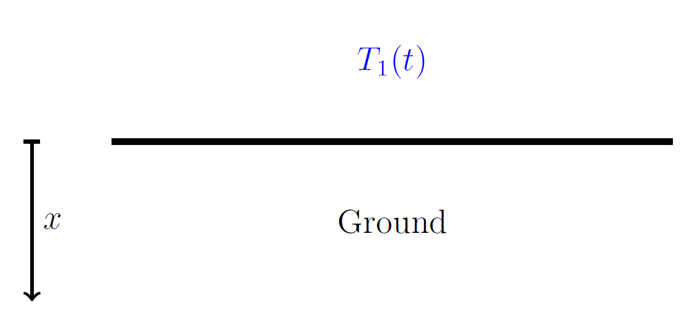
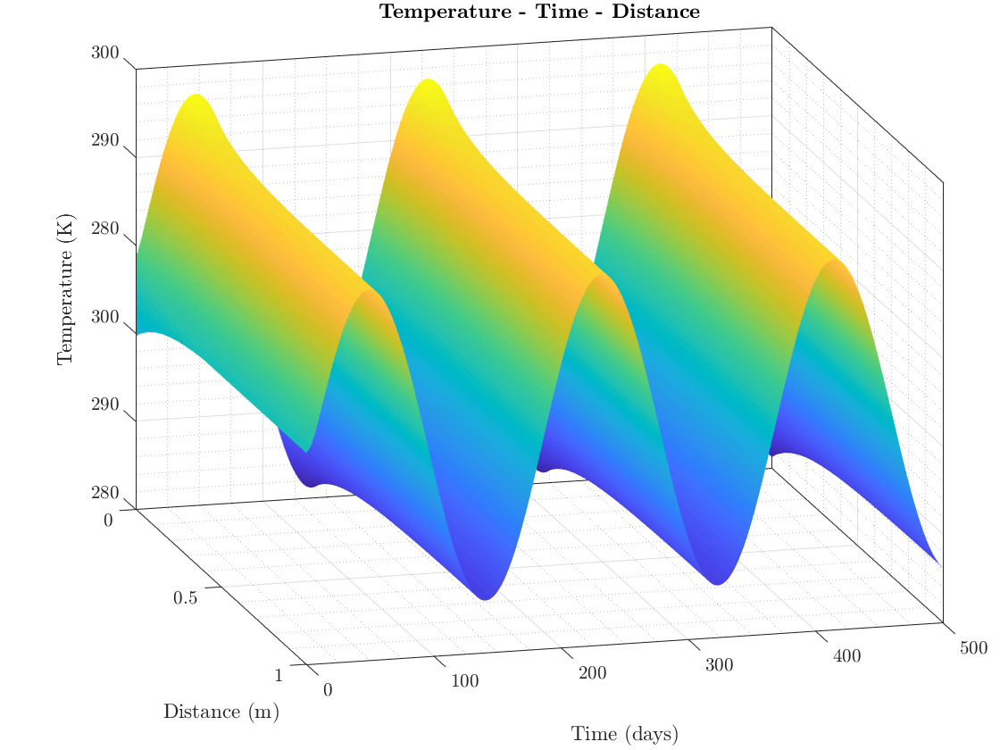

# 1D-Transient-Heat-Conduction
One-dimensional Transient Heat Conduction in a semi-infinite Domain

## Problem statement
We are interested in the temporal evolution of the ground temperature distribution. A onedimensional time-dependant heat conduction equation will be assumed to be valid to model the ground temperature (therefore, neglecting humidity changes or other aspects that may be actually relevant).

The resultant temporal study shows:

